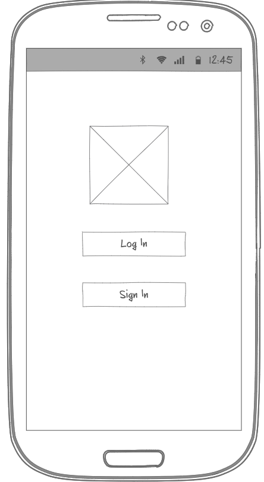
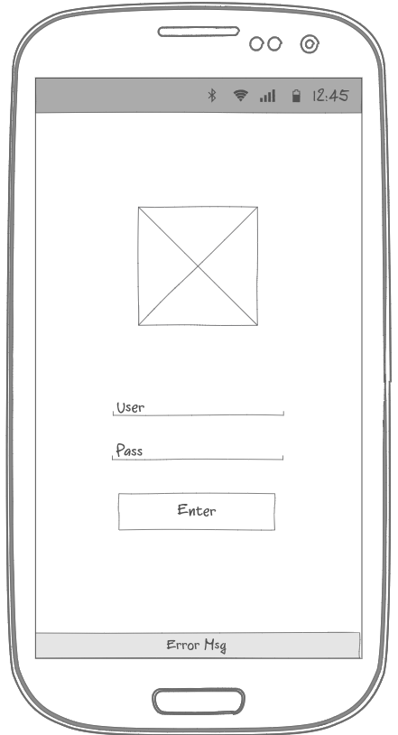
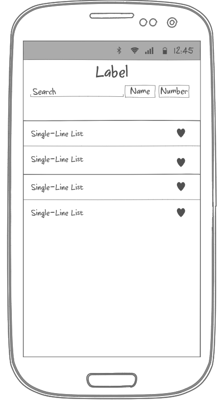
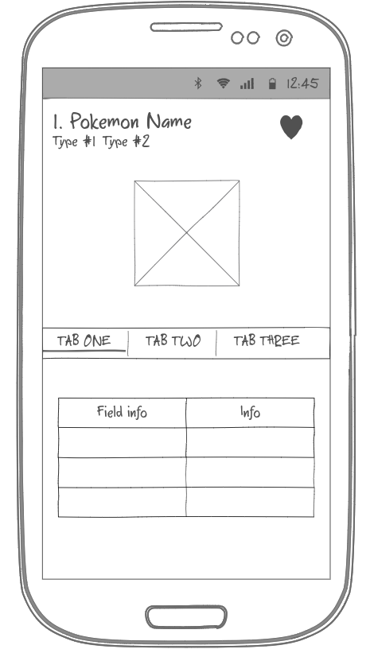

# Introduction ( Summary/Description )

App that serves as a Pokedex to all 898 pokemon. It shows basic information of each pokemon as their type, abilities and habitats. Allows to search for a specific pokemon by number or name. And you can storage your favorites pokemon.

---

## Requirements

- When the app is opened the first time it asks for authentication, that will be made using firebase
- After the authentication the app will open with a list of all pokemons
- When the user tap on a pokemon a new screen will open that shows the pokemon basic information
- In the pokemon screen, and in the pokemon list, the user can saved their favorite pokemon
- A floating button will be show and, if pressed it will opne the search for a pokemon option

### Extra

- There will be a Drawer with option to see list of moves, items, etc.

## Workflow Diagram

### Screens

#### Welcome Screen
  

- Select between Log In and Sign In
- Pokemon Logo that will be show on all the app ( Hero animation )
- Pass parameter to authentiation screen if the user want to Sign in or Log In

##### Widget Tree

- Scaffold
  - Column ( Centered )
    - Hero Animation ( Tag: Logo )
      - Image Widget
    - Elevated Button
    - Elevated Button

#### Authentication Screen

- Sign In
  - Introduce Email and password
  - Register User
  - Give Authorization
- Log In
  - Introduce EMail and password
  - Verify that they are correct
  - Give Authorization

##### Services

- Firebase Authorization ( FirebaseClient )

##### Widget Tree

- Scaffold
  - Column ( Centered )
    - Hero Animation ( Tag: Logo )
      - Image
    - Text Input
    - Text Input
    - Elevated Button

#### Favorite Pokemon Screen

- Show in a table format cards with the favorite pokemon of the user
- The card must have the image of the pokemon, the name, their types, and the background color must correspond to their type
- Selecting a card takes you to their pokemon screen
- Floating button that takes you to the search screen
- Pass the pokemon model to the pokemon screen if a favorite pokemon is selected

##### Services

- Firebase Storage to retrive the favorite pokemon list
- Network Manager to adquire the favorite pokemon information from PokeApi

##### Widget Tree

- Scaffold
  - Column
    - Text Widget ( Title )
    - List Viewer ( Show Pokemon Card )
      - List Element: Pokemon Card
        - Row
          - Image Widget ( Pkmn Image )
          - Column
            - Text Widget ( Name )
            - Text Widget ( Types )
  - Floating Button ( Search )

#### Search Screen

- Show a text input widget where one can select, with a button, to search a pokemon by name or by number
- Show to the user a simple list with all the pokemon, only showing number and pokemon name
- The user can save the pokemon to favorite from the list with a tap on an icon
- Selecting the pokemon from the list takes you to the pokemon screen
- Searching the pokemon if it is found it shows on the list if not display not found msg

##### Services

- Network Manager to retrive the pokemon list from the pokeapi and to search for the pokemon
- Firebase Storage to control the favorites pokemons

##### Widget Tree

- Scaffold
  - Column
    - Text Widget ( Title )
    - Row
      - Text Input ( Search )
      - Elevated Button ( Enter )
    - Row
      - Elevated Button ( By Number )
      - Elevated Button ( By Name )
    - List Viewer
      - List item ( Pokemon item )
        - Row
          - Text ( Number )
          - Text ( Name )
          - Icon ( Favorite )

#### Pokemon Screen

- Show the pokkemon information
- The background color depends on the pokemon type
- Show the iamg of the pokemon
- Has three sections: Basic Info., Moves annd habitats
- Can save the pokemon to favorites

##### Services

- Network manager to retrive th epokemon information
- Firebase Storage to save the pokemon to favorites if it is nessesary

##### Widget Tree

- Scaffold
  - Column
    - Row
      - Column
        - Text ( Pokemon Name and Nuber )
        - Row
          - Pokemon Types Widget
      - Icon ( Favorite )
    - Image ( Pokemon Image )
    - Card Info
      - Tab Widget
      - Table with information

---

## Tasks

- Make Welcome Screen
  - Make Ui
  - Make Controller ( Basic Function )
- Firebase Registration
  - Register App on Console
  - Prepare App
  - Export packages ( Core, Auth, Storage )
- Make Authorization Screen
  - Make Ui
  - Make Basic Function
  - Make workflow sig in
  - Make workflow Log in
- Make Network Manager
  - Export packages
  - Make constants for API calls
  - Make function to know if there is internet connection
  - Create basic fucntion to use ( get calls )
- Make Models
  - Make Pokemon Model
  - Make Submodels
- Integrate Firabase Storage
  - Create Firebase manager
- Make Favorite Pokemon
  - Make UI
  - Make Basic functions
  - Separete if there is favorite pokemon saved or not
  - Make API calls
  - Make Ui base on the API calls
- Make Search Screen
  - Make UI
  - Make Basic Function
  - Make api calls
  - Make Ui base on API calls
  - Make search feature
  - Make saved to favorite feature
- Make Pokemon Screen
  - Make UI
  - Make basic function
  - Separete if the model was passed or if it has to be loaded
  - Make API call if needed
  - Make UI Base on API call
  - Make Saved favorite pokemon feature
  